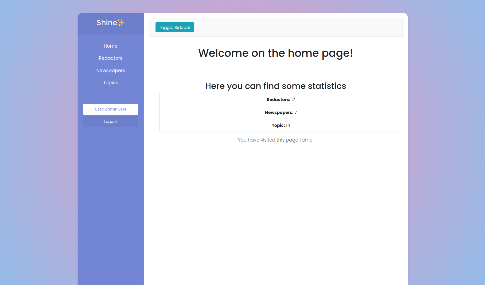
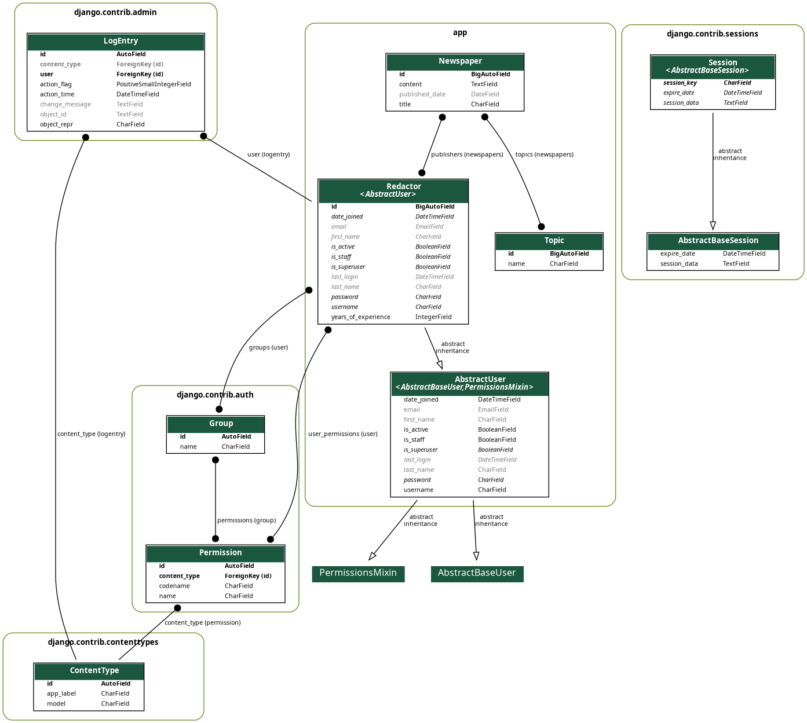

# **SHINE** - *eternal sunshine of the spotless mind*

App oriented to redactors for publishing their newspapers

## Check it out!

[SHINE deployed to render](https://shine-wy53.onrender.com/)

## Installation

```shell
git clone https://github.com/siaserb/shine.git
cd shine
python3 -m venv venv # for unix systems
python -m venv venv # for windows os
source venv/bin/activate # for unix systems
.\venv\Scripts\activate # for windows os
pip install -r requirements.txt
python manage.py migrate
python manage.py loaddata taxi_service_db_data.json # optional: just for filling db with data
python manage.py runserver
```

### Test User Credentials

For testing purposes, you can use the following test user credentials to log into the application:

- **Username:** `user`
- **Password:** `user12345`


## Features

* Authentication  functionality for Redactor/User
* Managing newspapers topics & redactors directly from website interface
* Powerful admin panel
* Every redactor can register himself to newspaper
* Every newspaper can have many topics

## Demo of home page



## Diagram of the project


